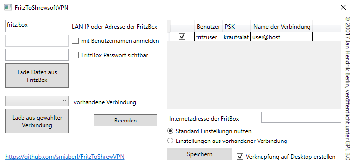

FritzToShrewVPN
---------------

Hallo und herzlich willkommen!

Für Windows 10 gab es lange keinen offiziellen VPN Client von AVM. ShrewSoftVPN
wurde als Alternative genannt und funktioniert weitestgehend einwandfrei. Nur
das Einrichten gestaltet sich mitunter etwas schwierig. Dies wird mit
FritzToShrewVPN deutlich einfacher.

### FritzToShrewVPN kann

-   Verbindungen in ShrewSoft einrichten

-   ShrewSoft Verbindungen bearbeiten und kopieren

-   Verknüpfungen für Verbindungen auf dem Desktop ablegen

 

### Wie nutzt man FritzToShrewsoftVPN

#### Vorausetzungen

ShrewSoftVPN 2.2.2 muss installiert sein [Download Seite von
ShrewSoft](https://www.shrew.net/download)

Die VPN Verbindungsdaten zur Fritzbox müssen bekannt sein

 

#### Installation

[Download FritzToShrewVPN](https://github.com/smjaberl/FritzToShrewVPN/archive/publish.zip)

setup.exe welche in dem zip liegt, ausführen
 

### Anwendung

-   Programm starten

-   Von oben nach unten lesen und dabei die passende Auswahl treffen. Dies
    sollte selbsterklärend sein

-   Domainname/IP, Benutzernamen und PSK eintragen

-   “Speichern und Beenden” klicken

-   fertig

 

 

### Was geschah bei der Anwendung des Programms

\* Vorhandene Verbindungen unter C:\\Benutzer\\\<name\>\\AppData\\Local\\Shrew
Soft VPN\\sites wurden eingelesen

\* Je nach Auswahl wurde eine neue Verbindung angelegt oder eine Vorhandene
bearbeitet bzw. kopiert.

\* Diese wurde in dem oben angegebenen Pfad gespeichert.

\* Je nach gesetztem Haken wurde ein Shortcut auf dem Desktop erstellt.

 

### Fragen, Anregungen und Feedback

... nehme ich gern unter der folgenden E-Mail Adresse entgegen: <a href="mailto:FritzToShrewVPN@HaschkeBerlin.de"> Jan Hendrik Berlin, FritzToShrewVPN@HaschkeBerlin.de</a>

### Dieses Projekt ist nicht verwandt oder verschwägert mit:

https://fritztoshrew.codeplex.com/

Eine Google-Suche nach "FritzToShrewsoftVPN" brachte mich zu dem Projekt fritztoshrew. Dies habe ich erst nach der Veröffentlichung bemerkt. 

Why this page is written in German.
-----------------------------------

Well, FritzToShrewVPN is a tool to create easily a VPN Connection to a FritzBox
using the ShrewSoft VPN Client. Because FritzBox is almost popular in Germany,
the author decided to write the tool with a German frontend. Hence it make sense
to write the documentation in German, too. Of course, if there are any
questions, you can ask for further details in English.
